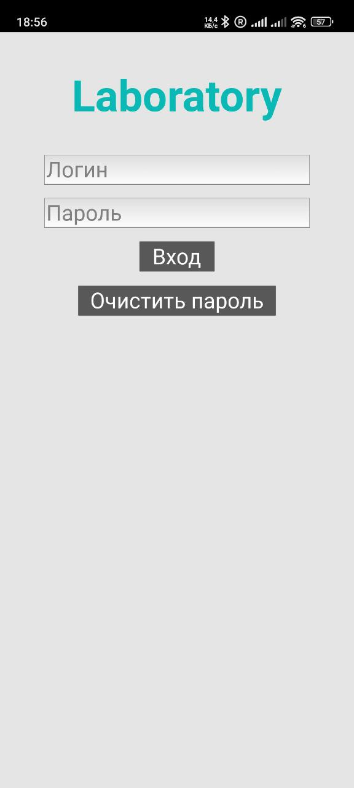
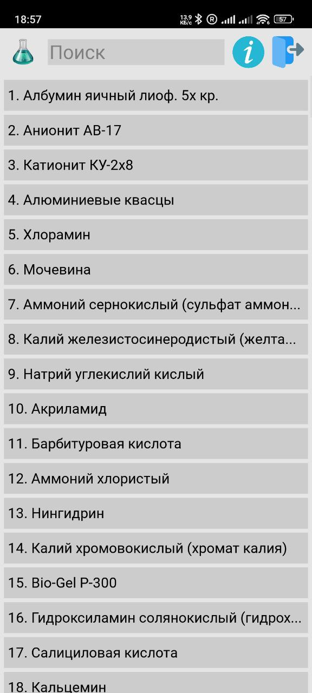
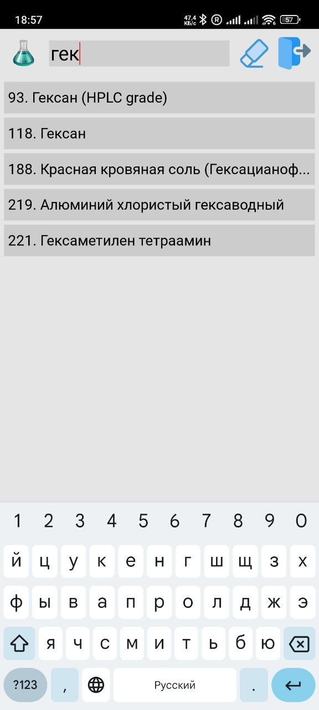
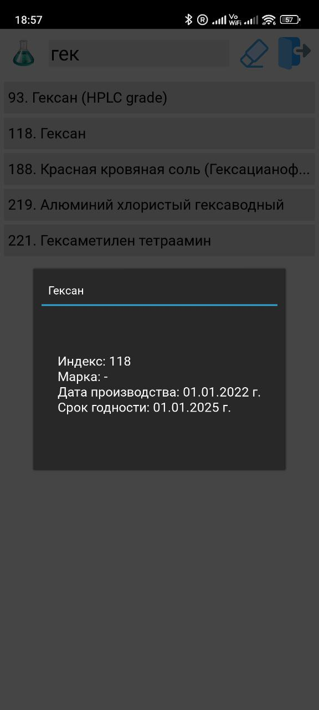

# Laboratory App
This is side project for [Laboratory](https://github.com/v-2841/laboratory)

It is an Android app for finding reagents. The app is built using Kivy, a Python-based framework for building mobile apps

## Installation
The latest version of the app can be downloaded from [Realeses](https://github.com/v-2841/laboratory-android-app/releases)

## Screenshots

## License
The Laboratory app is licensed under the MIT License. See the LICENSE file for details
